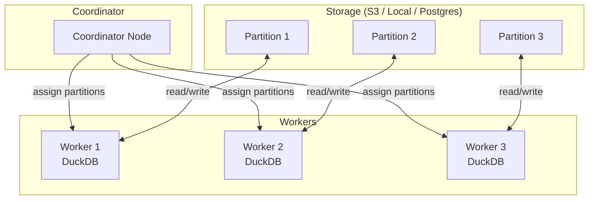
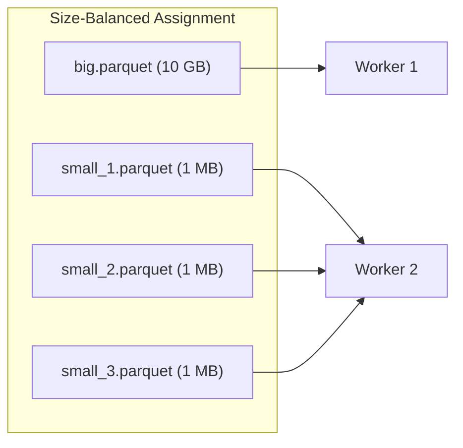
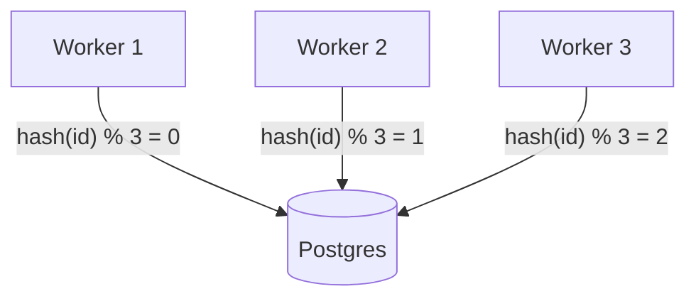
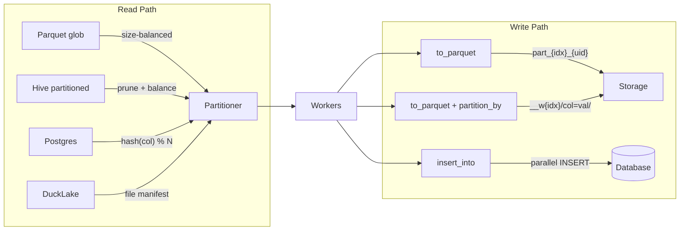

# Distributed IO

A guide to distributed reads and writes in Dux — how data moves between workers,
storage, and databases in a multi-node cluster.

## Overview

Dux's distributed IO builds on two principles:

1. **Workers read directly from storage** — no data funnels through the coordinator
2. **Workers write directly to storage** — each worker writes its partition independently



## Distributed Reads

### Parquet: Size-Balanced File Assignment

When reading Parquet globs, the coordinator expands the glob and distributes
files across workers. Assignment is **size-balanced** — larger files get their
own workers while small files cluster together:

```elixir
# 6 files, 3 workers — big file gets its own worker
Dux.from_parquet("s3://lake/events/**/*.parquet")
|> Dux.distribute(workers)
|> Dux.filter(amount > 100)
|> Dux.group_by(:region)
|> Dux.summarise(total: sum(amount))
|> Dux.to_rows()
```



For local files, sizes come from `File.stat` (instant). For S3 globs, the
coordinator expands the glob via DuckDB's `glob()` (uses S3 `ListObjectsV2`)
and distributes individual files.

### Hive Partition Pruning

For Hive-partitioned datasets (`year=2024/month=01/data.parquet`), the
partitioner automatically skips files whose partition values don't match
pipeline filters:

```elixir
# Only reads year=2024 files — year=2023 files are never touched
Dux.from_parquet("s3://lake/events/**/*.parquet")
|> Dux.distribute(workers)
|> Dux.filter(year == 2024)
|> Dux.group_by(:month)
|> Dux.summarise(total: sum(revenue))
|> Dux.to_rows()
```

Pruning works for simple equality predicates on partition columns
(`year = 2024`, `region = 'US'`). Complex expressions, OR predicates, and
range comparisons are not pruned — but that's safe, it just reads more data.

### Postgres: Hash-Partitioned Reads

For attached Postgres databases, use `partition_by:` to enable distributed reads.
Each worker ATTACHes Postgres independently and reads a hash-partitioned slice:

```elixir
Dux.attach(:pg, "host=db.internal dbname=analytics", type: :postgres)

Dux.from_attached(:pg, "public.orders", partition_by: :id)
|> Dux.distribute(workers)
|> Dux.filter(status == "active")
|> Dux.group_by(:region)
|> Dux.summarise(total: sum(amount))
|> Dux.to_rows()
```

Each worker executes `WHERE hash(id) % N = worker_idx` — DuckDB pushes this
filter to Postgres, so each worker only transfers 1/N of the data.



Without `partition_by:`, attached sources read on the coordinator only
(the existing broadcast-join pattern for dimension tables).

### DuckLake: File Manifest Resolution

For DuckLake catalogs, the coordinator queries the file manifest
(`ducklake_list_files()`) and distributes the backing Parquet files directly.
Workers don't need the DuckLake extension — they just read Parquet:

```elixir
Dux.attach(:lake, "ducklake:metadata.db", type: :ducklake)

Dux.from_attached(:lake, "analytics.events")
|> Dux.distribute(workers)
|> Dux.to_rows()
```

## Distributed Writes

### Parallel File Writes

When a distributed pipeline writes to Parquet, CSV, or NDJSON, each worker
writes its partition to a separate file:

```elixir
Dux.from_parquet("s3://input/**/*.parquet")
|> Dux.distribute(workers)
|> Dux.filter(status == "active")
|> Dux.to_parquet("s3://output/result/")
# Creates: part_0_12345.parquet, part_1_12346.parquet, ...
```

File names include the worker index and a unique ID to prevent collisions on
retry. The coordinator doesn't touch the data — it only collects status from
workers.

### Hive-Partitioned Output

Add `partition_by:` to produce a Hive-style directory structure:

```elixir
Dux.from_parquet("s3://input/**/*.parquet")
|> Dux.distribute(workers)
|> Dux.to_parquet("s3://output/events/", partition_by: [:year, :month])
# Creates: __w0/year=2024/month=01/data_0.parquet
#          __w1/year=2024/month=01/data_0.parquet
#          ...
```

Each worker writes to its own subdirectory (`__w0/`, `__w1/`) to avoid
concurrent directory creation races. Readers use `**/*.parquet` to find
all files across worker directories.

> #### Small file compaction {: .info}
>
> Distributed writes with `partition_by` produce N_workers files per partition.
> For DuckLake or Iceberg targets, run the catalog's native compaction to merge
> small files. Dux does not handle compaction — it's the catalog's job.

### Distributed `insert_into`

Insert pipeline results into a database table in parallel. Each worker
ATTACHes the target database and INSERTs its partition:

```elixir
Dux.attach(:pg, conn_string, type: :postgres, read_only: false)

Dux.from_parquet("s3://input/**/*.parquet")
|> Dux.distribute(workers)
|> Dux.insert_into("pg.public.events", create: true)
```

For `create: true`, the first worker creates the table, then the remaining
workers INSERT in parallel. Per-worker transactions — not atomic across workers.

## Data Flow Summary



## Fault Tolerance

| Scenario | Behavior |
|----------|----------|
| Worker fails during read | Coordinator raises (partial results not returned) |
| Worker fails during file write | Retry on surviving worker; orphan files have unique IDs |
| Worker fails during insert_into | Warning logged; surviving workers' inserts commit |
| All workers fail | `ArgumentError` raised with all error reasons |

File writes are idempotent — unique file names mean a retry never overwrites
a previous attempt's output. Database inserts use per-worker transactions.

## Telemetry

Distributed IO emits telemetry events for monitoring:

| Event | Measurements | Metadata |
|-------|-------------|----------|
| `[:dux, :distributed, :write, :start]` | — | `format`, `path`, `n_workers` |
| `[:dux, :distributed, :write, :stop]` | `duration` | `n_files`, `files` |
| `[:dux, :distributed, :write, :exception]` | `duration` | `kind`, `reason` |

## What's Next

- [Distributed Queries](distributed-queries.livemd) — the execution model (Coordinator, Worker, Merger)
- [Data IO](data-io.livemd) — single-node file reads and writes
- [Getting Started](getting-started.livemd) — core Dux concepts
